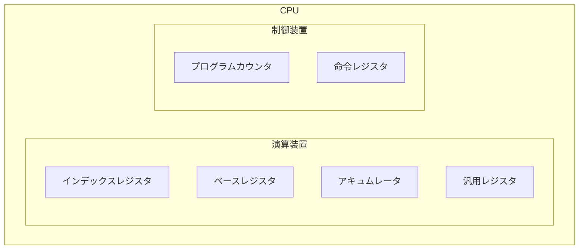
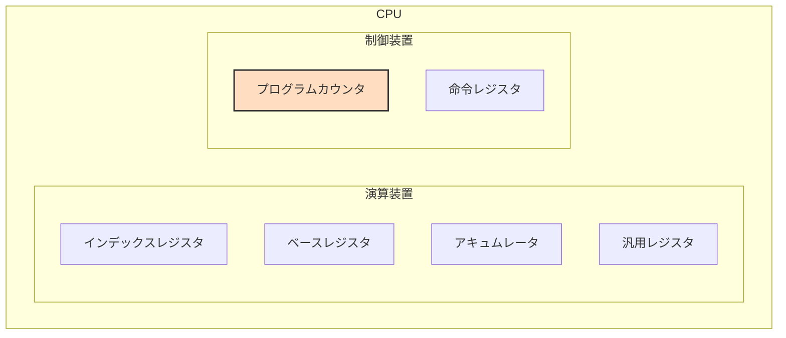
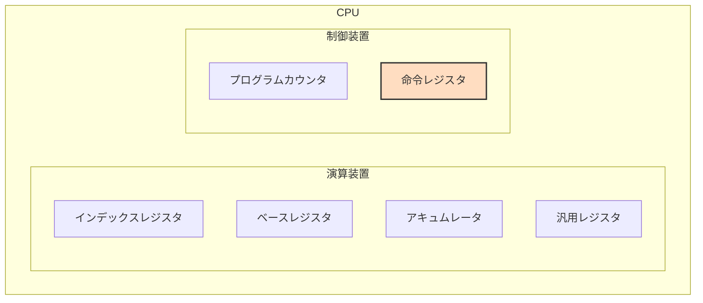
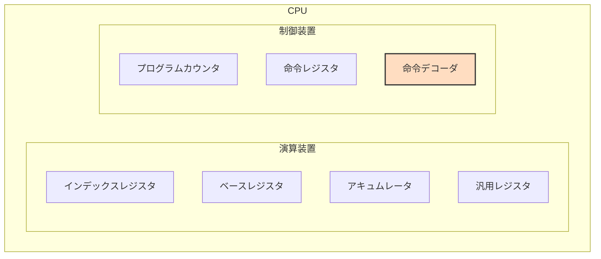
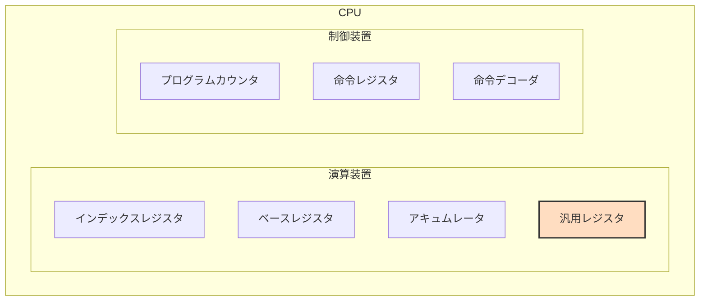

## CPUの中身

**実行手順**

- プログラムカウンタの中に取り出すべき命令のメモリアドレスを指している。

- 取り出した命令は命令レジスタに記憶される。
- この時、命令カウンタは+1される。

- 命令レジスタの命令部は命令デコーダに送られ命令部のコードを解読する。

- 処理の対象となるデータは、命令レジスタのオペランド部に存在する。
- オペランド部にメモリアドレスを指しており、メモリから値を取得し、汎用レジスタに値を保存する。
