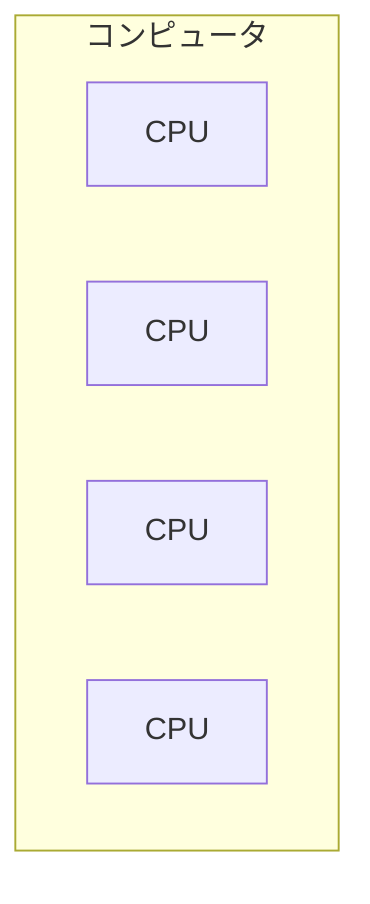
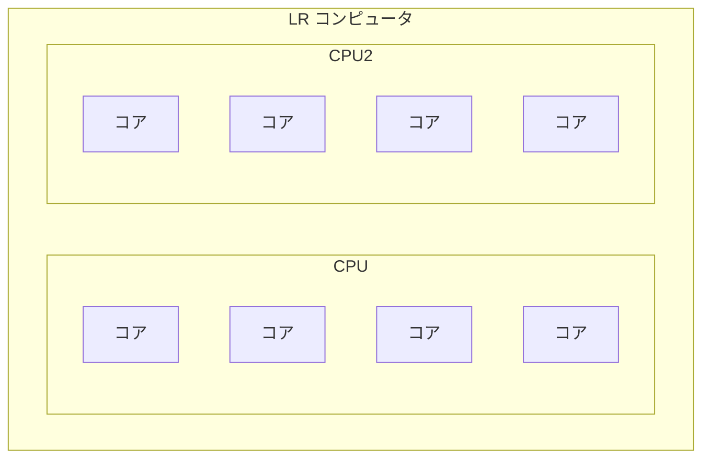

## ノイマン型コンピュータ
- プログラム内蔵方式、逐次制御方式の特徴があるコンピュータのこと
  - プログラム内蔵方式
    - 補助記憶装置(ハードディスクやCD-ROM)に保存されているプログラムをあらかじめ主記憶装置上に読み込んでおく方式
  - 逐次制御方式
    - 主記憶装置から命令を1つずつ取り出して順番に実行する方式
## レジスタ
- メモリから取得した命令はCPU内部にあるレジスタに保持される。
- レジスタの種類
  - プログラムカウンタ
    - 次に実行するべき命令が入っているアドレスを記憶するレジスタ
  - 命令レジスタ
    - 取り出した命令を一時的に記憶するレジスタ
  - インデックス(指標)レジスタ
    - アドレス修飾に用いるためのレジスタ。連続したデータの取り出しに使うための増分値を保持する
  - ベースレジスタ
    - アドレス修飾に用いるレジスタ。プログラムの先頭アドレスを取得する
  - アキュームレジスタ
    - 演算の対象となる数や、演算結果を記憶するレジスタ
  - 汎用レジスタ
    - 特に機能を限定しないレジスタ。

## 命令の実行手順
- ①命令の取り出し
  - 取り出すべき命令がプログラムカウンタにある
  - 取り出した命令を命令レジスタに記憶
  - 取り出しおわったらプログラムカウンタを増加
- ②命令の解読
  - 命令レジスタには命令部とオペランド部が存在する
    - 命令部：実行させたい命令の種類を示す
    - オペランド部：処理対象となるデータを収めたメモリアドレスなどが入っている
  - 命令部の中身を命令デコーだに送る
  - 命令でコーダはコードを解読して、必要な装置(演算装置ALUなど)に制御信号を送る
- ③対象データの読み出し
  - 命令が演算処理の場合、演算の元となる数値が必要
  - 処理の対象となるデータは命令レジスタのオペランド部に存在する。
  - オペランド部を参照して対象データを読み出し、汎用レジスタに記憶させる。
- ④命令実行
  - 汎用レジスタから処理対象データを取り出して演算
  - 演算結果を汎用レジスタに書き込んで終了

## 機械語のアドレス指定方式
- 命令は、「何(オペランド部)をどうしろ(命令部)」と言う記述になっている。
- オペランド部には絶対メモリアドレスが入っているわけではない。
- 基準値からの差分が入っていたりして、実際のメモリアドレスが入っていない場合がある。
  - 何らかの計算によってメモリアドレスを求める方法をアドレス修飾という
- **即値アドレス指定方式**
  - オペランド部に対象となるデータそのものが入っている
  - 値が入っているため、メモリアドレスへの参照は行わない。
- **直接アドレス指定方式**
  - オペランドに入っているメモリアドレスにデータが入っている場合の方式
- **間接アドレス指定方式**
  - 対象とするデータが入っているメモリアドレスが入っているメモリアドレスが入っている方式
- **インデックスアドレス指定方式**
  - オペランド部の値にインデックスレジスタの値を加算することで実行アドレスを求める方式
- **ベースアドレス指定方式**
  - オペランド部の値にベースアドレスを加算することで実行アドレスを求める方式
- **相対アドレス指定方式**
  - オペランドの値とプログラムカウンタの値を加算することで実行アドレスを求める方式
## バイトオーダ
- メモリ上では、1バイトごとにアドレスが割り振られる。
- 2バイト以上のデータをどのような並びでメモリ上に格納するかがバイトオーダ
  - 上位から下位バイトの順にメモリに配置する方式：ビッグエンディアン
  - 下位から上位バイトの順にメモリに配置する方式：リトルエンディアン

## CPUの性能指標
  - クロック周波数
    - クロックとは
      - 周期信号。クロックが1秒間に繰り返される回数のこと
      - 時間が短ければ短いほど、より多くの処理が行うことができる。
    - クロックサイクル時間
      - クロック周波数が4Hzの場合は、0.25秒
  - CPI(Clock cycle per Instruction)
    - 1命令あたり何クロックサイクルが必要か
    - クロックサイクル時間とCPIを使って、命令の実行時間を求められる。
  - MIPS
    - Million Instruction Per Second
    - 1秒間に実行できる命令の数
  - 命令ミックス
    - 命令は、命令の取り出し、命令の解読、対象データの読み出し、命令実行の手順で行われる。
    - しかし、命令によってはメモリに直接データが入っている場合は読み出しの手順が入らなくなる。
    - よって、命令は種類によって必要なクロックサイクルが異なる。
    - 命令ミックスとは、よく使われる命令を一つのセットとしたもの。
    - 例
      - 1GHzのCPUが次の命令セットでできていた場合、その処理能力は何MIPS?
        - 命令1. 実行時間:10, 出現頻度: 60%
        - 命令2. 実行時間:5, 出現頻度: 40%
      - クロックサイクル時間(clock/s) = 1/10^9 s
      - 命令ミックス(integration/clock) = 10*0.6 + 5*0.4 = 8クロック
      - 1秒間に何回命令を実行できるか(integration / s) = 8 * 1/10 = 8e-9
      - mips (s/ integration) 1/8e-9

## CPUの高速化技術
- パイプライン処理
  - 複数の命令を並行して実行すること
    - 命令を先読みして取り出しているため、分岐命令など出てきたら先読み分が無駄になることもある。
    - このパイプラインの処理の乱れをハザードという
  - 分岐予測と投機実行
    - 分岐により、次の命令は何かを予測して先に取り出しておくことを分岐予測という
    - 上記の予測に基づき、後々無駄になっちゃうかもだけど、多分必要だからやってしまおうというのが投機実行。
## 並列処理
- 複数のプロセッサを協調して処理にあたらせる技術などのこと
  - マルチプロセッサシステム
    - 各CPUに対して処理を分散させる
    - 対象型マルチプロセッサ
      - 全てのプロセッサを同等に扱って処理を並列化する方式
    - 非対称型マルチプロセッサ
      - それぞれのプロセッサに役割を決める
  - マルチコアプロセッサ
    - 一つのCPUパッケージに複数コアを持たせたもの

**疑問**
- マルチプロセッサとマルチコアプロセッサの違いは？？？
  -

**マルチプロセッサ**
一つのコンピュータの中に複数のCPUが存在する条件

**マルチコアプロセッサ**
一つのCPUの中に複数のコア(脳みそ)が存在する条件

